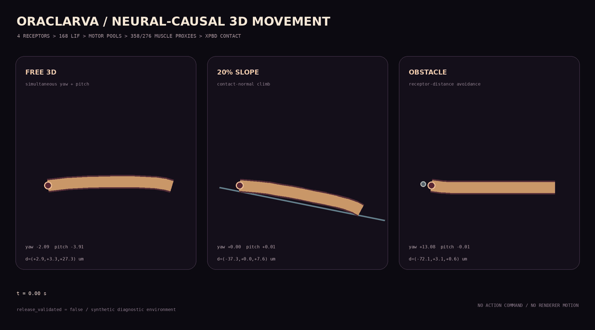
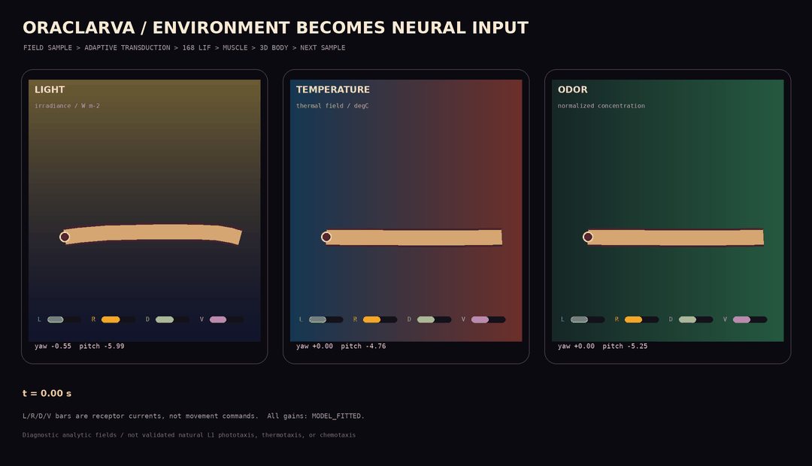
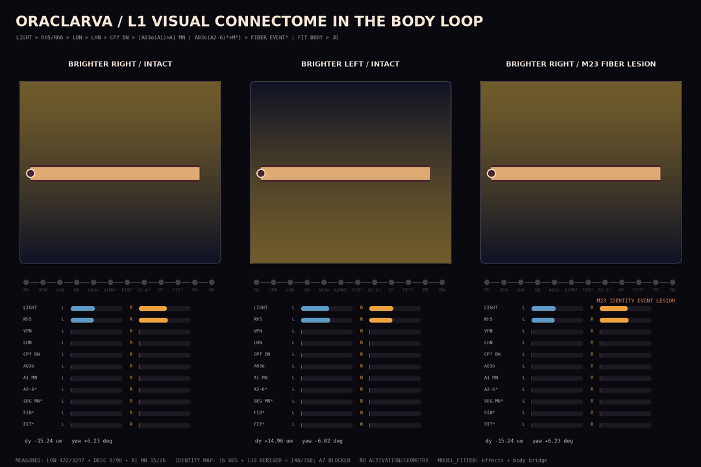
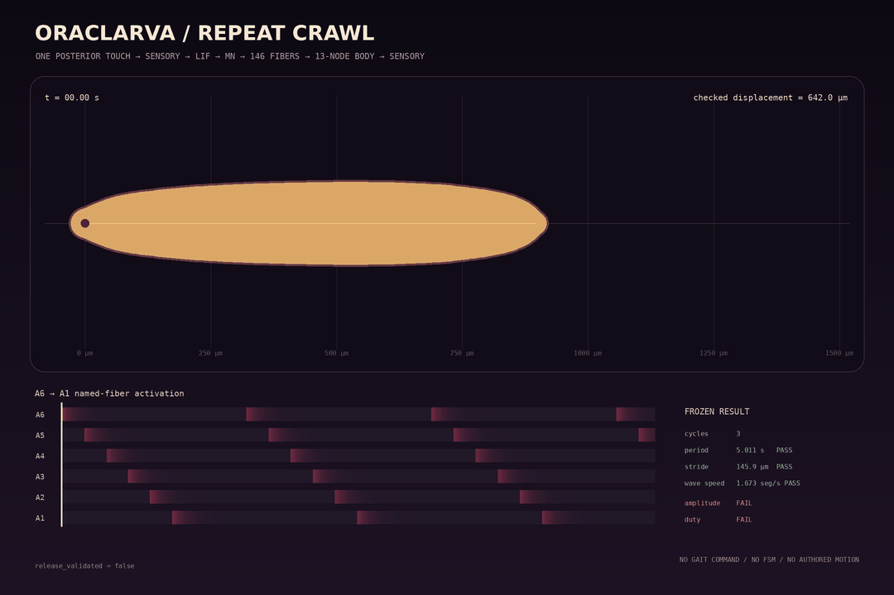
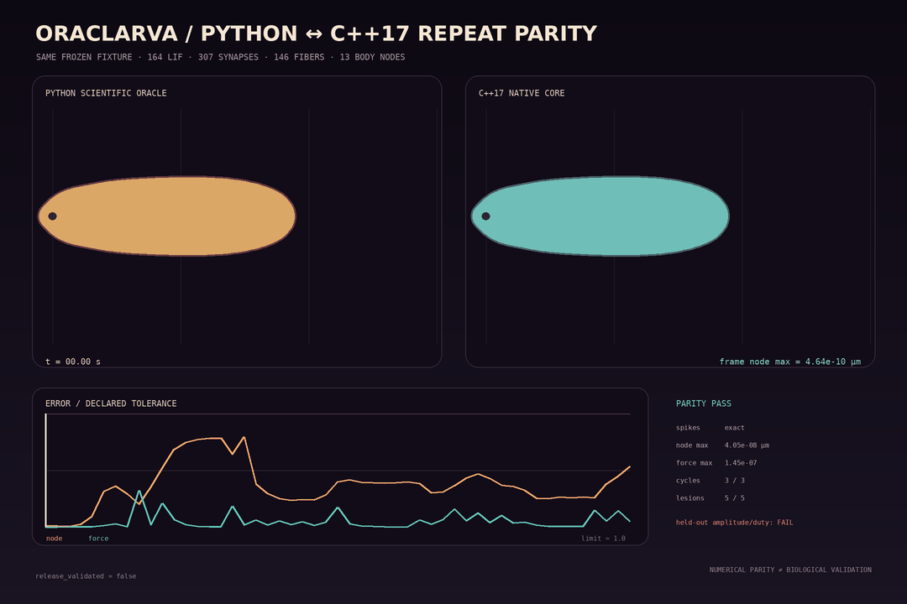
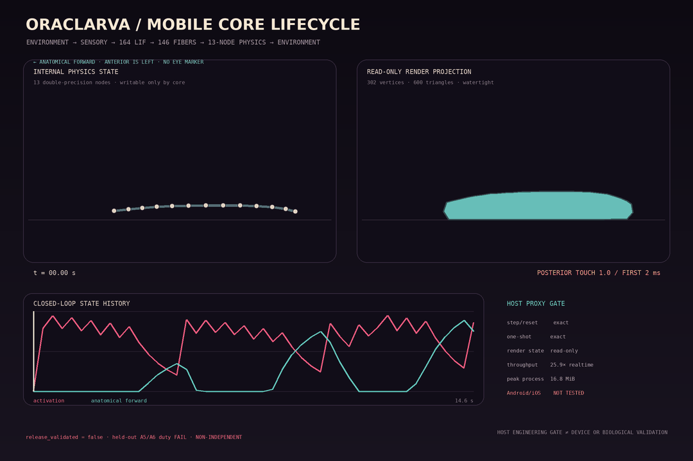
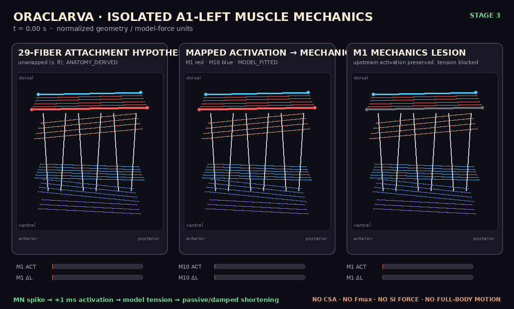

# Oraclarva

Oraclarva is an experiment in building an **on-device, connectome-driven digital organism**. The environment does not choose actions. Sensory signals enter a spiking neural network; motor-neuron activity drives muscles; body physics changes the next sensory input.

## Causal contract

```text
environment -> receptors -> neurons/synapses -> motor neurons -> muscles -> body physics
```

The simulation may contain physical and biophysical equations, but it must not contain behavioral shortcuts such as `if food: turn_left()` or animation-driven movement.

## What exists today

This repository starts with a small, auditable vertical slice:

- a unit-consistent leaky integrate-and-fire (LIF) reference simulator;
- sparse, event-driven excitatory and inhibitory synapses;
- neuron-lesion support;
- a CSV connectome audit command;
- causal tests from sensory input to motor output;
- scientific-scope and mobile-core design notes.

The current vertical slice includes a provenance-aware L1 3D body specification,
a dependency-free XPBD reference body, and one continuous watertight surface
over twelve labeled mechanical regions. Run `oraclarva-body-spec` to inspect
which parameters are observed, derived from measurements, or still hypotheses.

`data/neuromuscular/l1_motor_map_v1.json` now cross-walks 58 published CATMAID
skeleton IDs to their A1 muscle targets (MN25 is represented in A2, as in the
source). Three supplementary skeleton IDs remain unresolved in the current
public API. Muscle gains and attachment geometry are not published by this
source, so the core still refuses to let the anatomical map drive release body
physics.

The first stage-specific behavior target is also checked in. It preserves
animal-level p10/median/p90 bands from 18 first-instar L1 animals for T3-A7
length, contraction amplitude, shortening rate, duration, and phase. The gate
is deliberately a plausibility screen: it records that PSC/T1/T2/A8,
age-matching, free-surface locomotion, and L1 muscle recruitment remain absent.

The abdominal muscle atlas now enumerates 358 bilateral fiber identities across
A1-A6 (58 in A1 and 60 in each of A2-A6). It does not fabricate 3D attachments,
force gains, or thoracic/terminal homology, so it still cannot actuate the body.

A research-only embodied vertical slice now closes the loop from posterior touch
through an A27h-like LIF premotor chain, aggregate motor pools, 58 curated
A1/A2 motor-identity LIF neurons, PMSI-like inhibitory pools, thresholded
motor excitation, continuous asymmetric muscle activation, 358 named
A1-A6 fiber proxies, XPBD body deformation, substrate contact, and
shortening-sensitive proprioception. It produces neural-causal displacement and
lesion effects, but its reduced topology is `ANATOMY_DERIVED` and all unmeasured
numeric gains are explicitly `MODEL_FITTED`. The in-sample calibration places
all seven adjacent onset-phase and all 24 T3-A7 amplitude/rate/duration
comparisons inside the checked-in animal-level p10-p90 bands.

The executable reference network contains 91 LIF neurons (33 reduced core + 58 identities). All 58 resolved motor identities fire normally; lesioning the 56 causal A1
identities preserves the aggregate A1 pool spike but blocks A1 proprioception
and T3 recruitment. A2's two MN25 identities remain diagnostic-only.
An A4 identity-segment lesion preserves A4 motor firing but blocks A4
proprioception and downstream A3-T3 recruitment. Individual attachments and
force gains remain unexecuted; equal identity recruitment is a `MODEL_FITTED`
aggregate proxy. This is not held-out or whole-body validation; the runtime
reports `release_validated: false`. See `docs/CLOSED_LOOP_L1_V0.md`; run
`oraclarva-organism`.

A bilateral research extension now executes 126 LIF neurons and 130 synapses.
A shared posterior sensory component drives the symmetric forward wave, while a
rectified left-right receptor difference recruits an anterior T3-A2 asymmetric
pulse. Side-resolved activation drives active-curvature XPBD and virtual
left/right proprioceptive rails. Symmetric input remains exactly straight;
left/right inputs produce exact mirrored headings of about ±2.46 degrees at the
current stable `MODEL_FITTED` fixture. This is an approximation informed by
reported anterior unilateral activity during larval turning, not a complete or
measured L1 turning connectome. See `docs/BILATERAL_STEERING_V0.md`; run
`oraclarva-bilateral --left 1 --right 0`.

A four-receptor spatial extension now adds dorsal/ventral head sensing and
local-binormal pitch without changing the causal contract. The combined core
executes 168 LIF neurons and 188 synapses, projects continuous output through
the published dorsal/ventral muscle spatial groups, and drives yaw plus pitch
on one XPBD body. Zero input is exact rest, and an arbitrary 73-degree initial
yaw rotates every one of the 151 physical trajectory frames within a 3e-9 um
coordinate tolerance.

A passive 3D contact world supplies plane and sphere signed-distance constraints
and four receptor samples; it never supplies a movement or orientation. The
checked research fixtures climb a 20% plane without penetration and use receptor
distance differences to steer clear of an offset sphere before contact. All
sensory cadence, thoracic overrides, curvature gains, and contact friction are
explicitly `MODEL_FITTED`; the ramp and sphere are synthetic diagnostics rather
than an L1 habitat. See `docs/SPATIAL_STEERING_AND_ENVIRONMENT_V0.md`; run
`oraclarva-spatial --left 1 --right 0 --dorsal 1 --ventral 0 --free`.

A provenance-aware environment-input front end now samples analytic light,
temperature, and odor fields at the four moving head-surface points. Each
sample retains its physical unit and passes through modality-scoped contrast
before entering the existing 168-LIF
spatial network. Every checked frame records raw field values, adaptation
state, modality drive, final receptor currents, muscle activation, and physical
nodes. L1 visual/olfactory connectomes and L1 thermotaxis support the input
structure; L2 phototaxis and odor work remain structure priors only. All
numeric transduction gains are `MODEL_FITTED`, and this is not validated natural
taxis. See `docs/ENVIRONMENT_INPUTS_V0.md`; run
`oraclarva-environment-input --modality light --free`.

The light path reaches an identified A1 premotor pair. Audited public
sources preserve the bilateral L1 LON matrices, a
PVL09/pOLP -> LHN -> CPf -> A03o(A1) route, and 15 observed A03o-to-A1-MN
edges. A bounded ANATOMY_DERIVED A2-A6 projection adds 10 ID-less A03o proxies
and 130 motor-target channels while A7 stays blocked. The observed and derived
outputs terminate in 146 uniquely mapped fibers; the other 212 atlas fibers
stay silent.

Every mapped output feeds a one-step-delayed MODEL_FITTED activation and an
ANATOMY_DERIVED attachment hypothesis. Right attachments exactly mirror the
A1-left fixture; A2-A6 use an explicitly labeled homology repeat. Active,
passive, and damping tension use MODEL_FITTED model units and project onto the
shared 13-node body. The historical parallel A03o-to-generic-body bridge is
disabled. Zero light gives exact rest, mirrored fields reverse lateral body
response, and MN, segment, and fiber lesions alter physics through their
supported mappings. No measured NMJ coordinate, CSA, Fmax, SI-valued muscle
force, or dorsal-versus-ventral visual sensor is claimed. See
docs/L1_VISUAL_CONNECTOME_LOOP_V0.md; run oraclarva-visual --duration 1.5.

Stage 5 now samples A1-A6 length, strain, strain rate, shortening, and contact
directly from that shared body. Two published A1 `dbd` identities enter the
sparse LIF network. Greaney et al. report 7 direct dbd-to-MN pairs / 11
contacts; the independent artifact preserves all of them, while only the 3
one-contact MN targets already present in the 146-fiber runtime execute. Under
zero light, an A1 stretch reaches four named fibers through dbd and those MNs;
sensory, MN, and fiber lesions break only their later causal stages. A2-A6
homologs, contraction sensing, and contact remain non-executable diagnostics.
See `docs/BODY_STATE_SENSORY_FEEDBACK_V0.md`.

The 18-animal Greaney kinematic target remains split into 12 calibration and
6 held-out animals. Stage 6 now produces three complete A6-A1 physical cycles
from one posterior touch and explicitly measures anatomical forward rather
than raw world-x sign. Corrective audits fixed force/friction ordering, active segment length,
axial projection, buckling, and a net-forward artifact with 476 um intra-cycle
back-slip. The new full-timestep maximum retrace is 16.63 um and progress
efficiency is 0.830. All calibration rows pass. The third six-animal diagnostic
also passes its rows, but the model changed after earlier held-out evaluations,
so it is not independent and `release_validated: false` remains mandatory. See
`docs/REPEAT_CRAWL_HELD_OUT_V0.md`.

Stage 7 executes the same corrected 14.6 s path in a dependency-free C++17
core rather than replaying Python frames. One generated fixture covers 164 LIF
neurons, 307 sparse delayed synapses, 144 mapped sources, 146 named fibers,
per-segment decay/active length, 13 body nodes, feedback, traces, and physical
cycle detection. All spike summaries match and all 488 sampled node,
activation, and applied-force frames stay inside strict tolerances. Zero input
and sensory, premotor, mapped-MN, and fiber lesions also match. This is
numerical parity only, not independent biological validation. See
`docs/REPEAT_CRAWL_NATIVE_PARITY_V1.md`.

Stage 8 exposes that C++ state through a C11 mobile lifecycle: deterministic
reset, one 1 ms environment-input step, copied neural/force/body snapshot, and
a separate read-only watertight render projection. The 14,600-step path equals
the Stage 7 one-shot path and reset replay is byte-stable. A Linux aarch64 host
proxy measures 25.72x simulated/wall throughput with 16.83 MiB peak process
RSS. These are host engineering results, not Android/iOS device measurements
or biological validation. See `docs/MOBILE_CORE_INTEGRATION_V1.md`.

The isolated A1 mechanics fixture gives all 29 A1-left fibers normalized
origins, insertions, rest lengths, lines of action, passive elasticity, damping,
and activation-driven tension. Stage 4 now reuses the supported subset in the
full visual body loop through right-side mirroring and A2-A6 homology. Those
coordinates remain ANATOMY_DERIVED and all mechanics remain MODEL_FITTED model
units rather than measured attachments or newtons. The isolated fixture stays
checked as a regression test. See docs/A1_HEMISEGMENT_MECHANICS_V0.md.

This is infrastructure for a scientific model, **not yet a validated whole-brain emulation**. The included smoke circuit is synthetic and is clearly labeled as such.

## Quick start

Requires Python 3.11+.

```bash
python -m venv .venv
. .venv/bin/activate
python -m pip install -e '.[test]'
pytest
oraclarva-smoke
oraclarva-body-spec
oraclarva-motor-map-audit
oraclarva-kinematics-targets
oraclarva-muscle-atlas-audit
oraclarva-bilateral --left 1 --right 0
oraclarva-pitch --dorsal 1 --ventral 0 --free
oraclarva-spatial --left 1 --right 0 --dorsal 1 --ventral 0 --free
oraclarva-environment-input --modality light --free
oraclarva-visual --duration 1.5
oraclarva-audit neurons.csv synapses.csv
```

CSV schemas are documented by `oraclarva-audit --help` and in `docs/SCIENTIFIC_SCOPE.md`.
The motor crosswalk, its exact evidence boundary, and remaining blockers are in
`docs/L1_MOTOR_CROSSWALK.md`.
The public-source manifest can be checked with `oraclarva-source-audit data/sources/source_manifest_v0.yaml`; the current file audit and exclusion decisions are in `docs/PUBLIC_SOURCE_AUDIT_2026-08-29.md`.
The kinematic screening protocol is in `docs/L1_KINEMATIC_VALIDATION.md`; the
muscle identity and geometry boundary is in `docs/L1_BODY_WALL_MUSCLE_ATLAS.md`.

## Interactive L1 body viewer

The `viewer/` app renders the shared `data/body/l1_body_v0.json` morphology
and the generated `data/trajectories/l1_bilateral_steering_v0.json` Python
trajectory. Its 151 frames contain 13 internal XPBD nodes and 24 side-resolved
activation channels sampled every 30 ms. Three.js averages only the two channels
for surface emissive display; position and curvature come directly from the
stored physics nodes. Three.js interpolates those nodes under one continuous surface; it
contains no independent gait, Gaussian contraction wave, bend animation, or
render-driven translation. Active shortening still uses one aggregate body-cavity
volume constraint rather than twelve sealed spherical segments.

```bash
cd viewer
npm install
npm run dev
```

The displayed L1 length, width, and per-region profile remain explicit v0
hypotheses, and the trajectory is model output rather than motion capture. Run
`python tools/export_bilateral_trajectory.py --check` to verify that the
checked-in viewer artifact matches the current 126-LIF Python reference. The
bilateral C++ parity test compares all 151 native frames with a 2e-9 µm absolute
node-coordinate ceiling across symmetric, left, right, zero-input, and lesion
conditions.

## Spatial and environment diagnostics

The spatial artifact contains three model-authored 151-frame trajectories:
combined free yaw/pitch, a symmetric 20% slope climb, and four-receptor
offset-sphere avoidance. The GIF below is rendered only from those 13-node
physics frames; it does not synthesize a gait or change position.



```bash
python tools/export_spatial_environment_trajectory.py --check
python tools/render_spatial_environment_gif.py
```

The multimodal environment artifact adds three field-driven trajectories and
stores the raw/adapted/drive/current chain alongside each physical frame.



```bash
python tools/export_environment_input_trajectory.py --check
python tools/render_environment_input_gif.py
```

The L1 visual-connectome artifact executes the published LON and selected
descending/motor contacts, then the explicitly ANATOMY_DERIVED A2-A6 branch.
Both routes terminate in named fibers whose attachment forces move the shared
body without a parallel generic motor core. The third panel switches light off
and applies a declared A1 stretch, then displays the isolated
body-state -> dbd -> mapped MN -> named-fiber force path. The overlay shows
continuous ACT* and FORCE* values derived only from earlier neural events.



```bash
python tools/compile_l1_visual_connectome.py --check
python tools/compile_l1_visual_descending_path.py --check
python tools/compile_l1_a03o_motor_path.py --check
python tools/compile_l1_a03o_segmental_projection.py --check
python tools/compile_l1_neural_muscle_identity.py --check
python tools/export_visual_trajectory.py --check
python tools/render_visual_gif.py
```

## Repeat crawl and held-out diagnostic

One posterior touch produces three checked A6-A1 cycles through body-state
feedback; there is no periodic stimulus or gait command. The checked body moves
+467.54 µm along the initial tail-to-head axis with zero lateral span/deviation.
Maximum full-timestep backward retrace is 16.63 µm, down from 476.20 µm, and
forward-progress efficiency is 0.830. Every calibration row passes. The third
held-out diagnostic also passes its rows, but it is reused and cannot support
an independent validation claim. The GIF labels anatomical forward explicitly;
the former eye-like black dot was removed and there is no eye marker.



```bash
python tools/export_repeat_crawl_trajectory.py --check
python tools/evaluate_repeat_crawl.py --check
python tools/render_repeat_crawl_gif.py
```

The paired diagnostic below is generated from the checked Python/C++ parity
report. Both panels render independently computed body nodes; neither panel
changes or synthesizes motion.



```bash
python tools/export_native_repeat_fixture.py --check
python tools/export_native_repeat_parity.py --check
python tools/render_native_repeat_parity_gif.py
pytest -q tests/test_native_repeat_parity.py
```

## Stateful mobile core diagnostic

The left panel below shows the 13 internal double-precision physics nodes. The
right panel is the separate 302-vertex/600-triangle read-only render projection
returned by the C ABI. Both come from the same stepped state; the renderer
cannot move the organism. The checked artifact also preserves exact reset
replay and `release_validated=false`.



```bash
python tools/build_mobile_core.py --output /tmp/oraclarva-mobile-build
python tools/export_mobile_core_integration.py --check
python tools/benchmark_mobile_core.py --check
python tools/render_mobile_core_gif.py
pytest -q tests/test_mobile_core.py
```

## Isolated A1 muscle mechanics diagnostic

The Stage 3 artifact shows the 29 schematic A1-left attachment lines, two
observed MN-to-muscle activations, and a post-activation M1 mechanics lesion.
The display is an unwrapped normalized coordinate diagnostic; it is not an
image-derived 3D atlas or a body animation.



```bash
python tools/export_a1_hemisegment_fixture.py --check
python tools/render_a1_hemisegment_gif.py
```

## Native parity

`native/` contains the first dependency-free C++17 numerical port. The Python
oracle and native binary consume the same versioned synthetic LIF fixture and
compare every step's spikes, voltage, excitatory current, and inhibitory current,
including an interneuron lesion. Run `pytest tests/test_native_parity.py`.
The second shared fixture covers the current embodied approximation itself. C++
directly executes all 91 neurons, continuous segment activation, the 358-fiber
aggregate proxy, XPBD body, substrate contact, and proprioceptive feedback. Its
normal, no-stimulus, and three lesion runs match Python on spikes, first-spike
times, peak activation/shortening, displacement, and every sampled 13-node
trajectory frame. Run `pytest tests/test_native_closed_loop_parity.py`.

The third fixture, `data/parity/bilateral_native_v1.tsv`, covers 126 side-resolved
neurons, 130 synapses, bilateral muscle proxies, active curvature, local-tangent
contact friction, and left/right rail feedback. Seven symmetric, asymmetric,
zero-input, and lesion cases match Python on every spike, summary, activation,
shortening value, and all 151 trajectory frames. Run
`pytest tests/test_native_bilateral_parity.py`.

The fourth fixture, `data/parity/repeat_crawl_native_v1.tsv`, executes the
checked corrective repeat path: 164 neurons, 307 synapses, adaptation and
delayed feedback, 144 mapped sources, 146 fiber activations, active-length
13-node XPBD mechanics, and cycle detection. The normal 14.6 s run plus
zero-input and four causal lesions match the Python oracle on exact spikes and
strict sampled-state tolerances. Run
`pytest tests/test_native_repeat_parity.py`.

The Stage 8 C11 ABI advances the same repeat core one fixed step at a time and
returns copied spike/trace/force/body state plus a separate read-only render
mesh. Static/shared host artifacts export only eight C symbols. Full stepped,
one-shot, reset replay, five causal cases, C compatibility, and mesh
manifoldness are checked by `tests/test_mobile_core.py`.

This establishes native numerical parity and a host-tested integration
boundary for the current research approximations, not a complete L1 brain/VNC,
measured individual muscle mechanics, held-out biological validation, an
Android/iOS build, or device performance.

## Non-goals for the reference core

- claiming consciousness or a complete mind upload;
- hiding missing anatomy behind behavior trees or learned control policies;
- treating anatomical connection count as proof of functional behavior;
- tuning against appearance alone without neural and behavioral validation.

The original research plan is preserved in `Drosophila Larva Whole-Brain Emulation Project.md` as historical project context.
