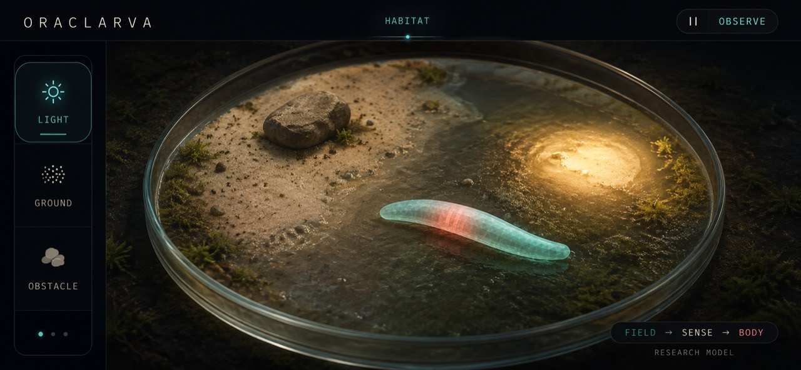
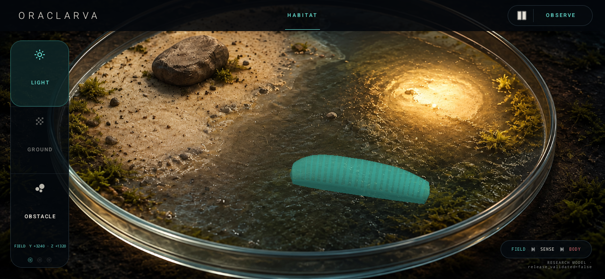

# Android Habitat UI v1

The Stage 10 native runtime now uses the selected Petri-dish Habitat composition
as its primary landscape observation screen.





## Visual sources

| Artifact | Role | SHA-256 |
| --- | --- | --- |
| `docs/assets/habitat-ui-reference.jpg` | User-selected visual target, 1280 × 592 | `4e620e5100bac6666fc0d2f07b79b835c27242d7f1cef088d60a338515d5c4ab` |
| `android/app/src/main/res/drawable-nodpi/habitat_plate.png` | Image-generated UI background with all text, controls, and organisms removed | `3665d44b9adc18c6db053c649f13f47153195b9af6525e68d0c6ec66b42d60c3` |
| `docs/assets/habitat-ui-redroid.png` | Actual Android 13 ReDroid capture, 1280 × 592 | `fe31639597dfe4127ad90079e259f59f40e0181fb9c80d459702b6be7c25f02c` |

The rail and light-marker icons use the rounded Android vector assets
`light_mode`, `grain`, and filled `bubble_chart` from Google's Material Symbols
repository under Apache License 2.0. They replace device-dependent Android
framework menu icons so the meaning and silhouette remain stable across hosts.

The Petri dish and substrates are illustrative product art. They are not
measured L1 anatomy or a spatially calibrated physical substrate dataset.
The live larva is not baked into the raster asset: its continuous render mesh
still comes from the C++ closed-loop state.

The implementation capture was taken through ADB from an ARM64 ReDroid
Android 13 container at 160 dpi. It used ANGLE/SwiftShader software rendering,
so it verifies launch, pixels, interaction, and runtime stability—not physical
device GPU performance, thermals, or battery behavior.

## Interaction contract

- Dragging inside the Habitat updates the two physical light-field gradients.
  The values enter the existing sensory transform; the UI does not write a
  heading, pose, or body position.
- Pause freezes fixed-step advancement while retaining the rendered state.
- The checked neural/physics fixture has a finite 14,600-step validation
  horizon. The observation app reads that native metadata and resets at the
  boundary so the research fixture can repeat without advancing outside its
  validated range. This replay boundary is not a behavior or movement rule.
- Observe reveals live C++ time, displacement, yaw, pitch, spike count, field
  values, and `release_validated=false`.
- Obstacle exposes the already modeled two-millisecond posterior physical
  contact pulse.
- Ground editing is intentionally disabled. The visual sand/wet split must not
  be interpreted as a live friction map until spatial substrate contact exists.

The causal claim remains:

```text
environment field/contact -> sensory transform -> sparse LIF network
-> motor neurons -> muscle activation -> 3D body physics -> environment
```

## Layout and accessibility

The screen is landscape-only and uses a 66 dp observation header, a 124 dp
left tool rail, a full-screen OpenGL habitat, and a bottom-right causal badge.
Core controls have at least a 44–48 dp touch target and content descriptions.
Official Material Symbols Android vectors supply the Habitat tool icons; the
hero background is a real raster asset rendered as an aspect-preserving center
crop.
