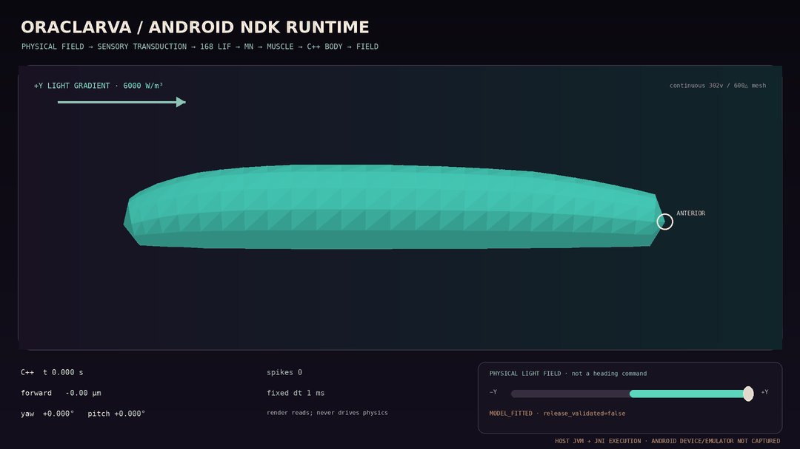

# Stage 10 Android NDK runtime

## Result

Stage 10 places the Stage 9 integrated environment closed loop behind an
Android application boundary. Kotlin owns lifecycle, physical input controls,
the fixed-step accumulator, telemetry, and OpenGL ES 3 rendering. JNI owns one
C++ core and copies state into caller-owned arrays. The renderer consumes the
native 302-vertex/600-triangle continuous surface; it never writes physics
nodes or supplies displacement, heading, gait, or animation commands.

The per-step causal order remains:

```text
physical light/contact field
  → sensory transduction
  → sparse LIF dynamics
  → motor neurons
  → muscle activation
  → shared 13-node 3D body physics
  → updated sample positions in the physical field
```

The Android controls expose lateral and dorsal–ventral light gradients in
`W/m³` plus a two-step posterior contact pulse. Their labels explicitly state
that they are sensory inputs, not heading commands. All light, transducer,
body, and muscle gains retain their existing provenance and claim boundaries.



The GIF is generated from 51 mesh frames copied through the actual JNI bridge
on the host JVM. It is not Android device or emulator footage. This distinction
is printed in the image itself.

## Mobile architecture

- `NativeOrganism` is created, advanced, read, reset, and destroyed on its
  owning GL thread.
- A real-time accumulator advances the native core at fixed `dt = 1 ms`, with
  elapsed wall time capped at 50 ms and at most 50 physics steps per draw.
- JNI rejects calls larger than 1,000 steps and invalid or undersized output
  arrays. Java/Kotlin allocate state, vertex, and index arrays once and reuse
  them.
- `oraclarva_mobile_read_render_mesh` is the sole body geometry source. Kotlin
  recenters copied render positions for the camera but does not mutate C++
  state.
- The OpenGL ES 3 shader colors the surface by native muscle activation.
- The app requests no Android permissions and targets `arm64-v8a` and
  `x86_64`, with minimum API 26 and compile/target API 36.

The application uses Android Gradle Plugin 9.3.0, Gradle 9.5.0, Java 17,
CMake 3.28.3, and NDK 28.2.13676358. The checked wrapper records the official
Gradle distribution SHA-256
`553c78f50dafcd54d65b9a444649057857469edf836431389695608536d6b746`;
the wrapper JAR SHA-256 is
`497c8c2a7e5031f6aa847f88104aa80a93532ec32ee17bdb8d1d2f67a194a9c7`.

## Checked host JNI results

The bridge is compiled as a shared library, loaded by Java 17, and driven
through the exact static methods declared by Kotlin. The regression gate checks:

| Diagnostic | Checked result |
| --- | ---: |
| Uniform field duration | 14.600 s / 14,600 fixed steps |
| Anatomical forward displacement | 467.539285129721 µm |
| Uniform-field yaw | 0.000000000000° |
| Total spatial spikes | 53,524 |
| +Y 6000 W/m³ yaw at 4.5 s | -3.831016030048° |
| +Y lateral displacement | -1.956735327396 µm |
| Render projection | 302 vertices / 600 triangles |
| Reset replay | exact state, vertex, and index arrays |
| Release validation | false |

Separately, all five Kotlin source files compile with Kotlin 2.3.20 against the
publicly published Android 16 API stub from
[`org.robolectric:android-all:16-robolectric-13921718`](https://repo1.maven.org/maven2/org/robolectric/android-all/16-robolectric-13921718/).
The downloaded JAR matched SHA-256
`8b74a0a137330658d2f33f0dc715d42734f74ba8b2d7014fc2e95aa40d3f682d`
and produced 11 application classfiles without a compiler diagnostic. This is
an auxiliary source type check, not an AGP, APK, emulator, or Android device
build.

This test validates the C++/JNI contract and deterministic data transfer. It
does not establish device framerate, thermal behavior, battery use, GPU driver
compatibility, or biological validation.

## Android build and device boundary

The Gradle project and verified wrapper configure successfully up to Android
SDK package resolution. In the current environment the required API 36 build
tools and NDK package cannot be installed until an authorized user accepts the
Google Android SDK license. Consequently this revision does not yet claim a
successful APK, emulator launch, physical-device launch, or device performance
measurement.

`release_validated=false` remains mandatory. GitHub Actions also remains
manual-only through `workflow_dispatch`; the Android build is not added as an
automatic CI trigger.

## Reproduce

Host JNI boundary and visualization:

```bash
python tools/build_android_host_bridge.py
pytest -q tests/test_android_mobile_runtime.py
python tools/render_android_mobile_runtime_gif.py
```

After accepting the SDK license and installing API 36, Build Tools 36.0.0,
Platform Tools, and NDK 28.2.13676358:

```bash
cd android
./gradlew assembleDebug
```

An APK build alone must not be reported as device validation. Emulator or
physical-device execution and measurements require a separate recorded gate.
