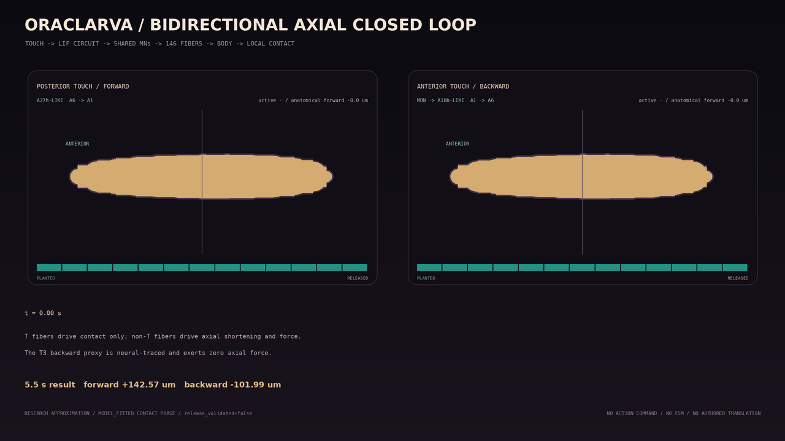

# Bidirectional axial locomotion v1

Status: `research_approximation`; `release_validated=false`.

This model replaces the forward-only diagnostic as the Python scientific
reference for straight axial locomotion. The older repeat-crawl model remains
checked for regression history but is not evidence for bidirectional motion.

## Executed causal path

```text
posterior touch -> A27h-like posterior-to-anterior path --+
                                                          +-> shared named MNs
anterior touch -> MDN -> A18b-like anterior-to-posterior --+        |
                       `-> Pair1-like inhibition of A27h            v
                                                    146 mapped fibers
                                                       |          |
                                        non-T axial shortening    T contact drive
                                                       |          |
                                                       +-> body/contact physics
anterior path -> MODEL_FITTED T3 contact-only proxy --------------+
                                                                  |
                                                      next body-state sample
```

There is no `crawl_forward()`, `crawl_backward()`, behavior FSM, external
policy, or pre-authored position update. A localized touch supplies receptor
current. Sparse LIF dynamics determine which premotor path spikes.

The A27h, MDN, Pair1, and A18b identities constrain relative circuit topology
from published larval work. Most named-circuit evidence is later-instar, so
its transfer to L1 is marked `ANATOMY_DERIVED`. Intersegmental delays,
currents, inhibitory persistence, and contraction/relaxation gains remain
`MODEL_FITTED`.

## One muscle atlas, different timing

Both paths converge on every segment's same named motor identities and the
same 146 A1-A6 mapped fibers. They do not select separate “forward muscles”
and “backward muscles.”

The reduced contact hypothesis uses transverse-group (`T`) activation as a
continuous attachment-release proxy. `T` fibers are excluded from segment
axial shortening and axial node force; the earlier implementation incorrectly
mixed their activation into both. DL/DO/VA/VL/VO fibers provide the axial
shortening and force proxy. Forward and backward premotor paths use different
fitted transverse recruitment delays while retaining the same A1-A6 identities.

The A1-A6 atlas leaves no anterior contact effector for the first backward
wave. A dedicated `motor_proxy:T3_transverse_backward` node therefore receives
the fitted A18b:A1 output and drives T3 contact release only. It exerts zero
axial force and is explicitly not claimed as a reconstructed L1 MN or measured
T3 muscle identity. This is an `ANATOMY_DERIVED` topology and `MODEL_FITTED`
timing hypothesis, added instead of inventing T3 attachment coordinates or
force values. It is independently lesionable and every nonzero proxy activation
has an ordered sensory-neural trace.

The body receives only per-node retention derived from local muscle/proxy
activation; it never receives desired direction or the sign of velocity.

For node (i):

```text
q_i = clamp(g * a_transverse,anterior(i), 0, 1)
r_i = r_planted + (r_released - r_planted) * q_i
```

The retention is applied symmetrically to either tangential displacement sign.
The values are not measured friction coefficients. Booth et al.'s L2
protopod-force observations motivate a local attachment/release mechanism,
but no L2 force is copied into this L1 model.

## Checked behavior

With the checked v1 parameters over 5.5 seconds:

- posterior touch produces an ordered A6 -> A1 A27h-like wave and anatomical
  forward displacement;
- anterior touch produces MDN and Pair1 activity, an ordered A1 -> A6
  A18b-like wave, and anatomical backward displacement;
- no touch produces no spikes, active force, or translation;
- MDN lesion blocks the backward path;
- an A27h lesion blocks forward propagation downstream of that segment;
- every active force frame has an ordered sensory -> premotor -> motor trace.

The first complete forward cycle passes all 29 required comparisons against
the 12-animal Greaney L1 calibration partition:

- stride: 140.65 um; crawl speed: 26.43 um/s;
- period: 5.322 s; frequency: 0.188 Hz;
- physical A6-to-A1 wave speed: 1.672 segment intervals/s;
- every A1-A6 contraction amplitude, shortening rate, contraction duration,
  and duty cycle lies within its calibration p10-p90 band;
- maximum opposite retrace is below 25 um, progress efficiency is above 0.8,
  and all straight-body distortion gates pass.

Across the complete 5.5 s visualization window, forward displacement is
142.57 um with efficiency 0.822; backward displacement is 101.99 um with
efficiency 0.817. Maximum opposite retrace is 21.03 um forward and 20.85 um
backward. These are model outputs, not measured backward L1 targets.

Four of five adjacent-onset-delay diagnostics remain outside their calibration
bands because the current reduced circuit retains a uniform 0.59 s A1-A6
intersegmental delay. A trial fitted to the nonuniform calibration medians
matched local timing but failed stride, efficiency, and retrace gates, so it was
rejected rather than accepted on timing alone.

The exact checked values and 5 ms sampled 13-node trajectories are in
`data/trajectories/l1_axial_locomotion_v1.json`.
The acceptance report is
`data/validation/axial_locomotion_calibration_v1.json`. The six-animal
held-out partition had already been visible during earlier work; it currently
fails four diagnostics and remains explicitly non-independent in
`data/validation/axial_locomotion_diagnostic_held_out_v1.json`.



## Scope boundary

This is not a complete L1 CNS/VNC, measured L1 grip model, or independent
biological validation. The contact phase relation and T3 contact proxy are
falsifiable fitted hypotheses. Calibration passing does not set
`release_validated=true`. Quantitative backward L1 kinematic targets, a new
unseen L1 cohort, and C++ parity remain separate acceptance gates before this
model can replace a native runtime.

The next implementation is left-right steering on top of this frozen axial
baseline. It must modulate side-resolved neural/MN/muscle timing; it may not
send yaw, turn direction, or a desired trajectory into body physics. Android
integration remains frozen until the Python scientific reference and its
steering validation are stable.

```bash
python tools/export_axial_locomotion_trajectory.py --check
python tools/evaluate_axial_locomotion.py --check
python tools/render_axial_locomotion_gif.py
pytest -q tests/test_axial.py tests/test_axial_artifact.py tests/test_body_contact.py
```
