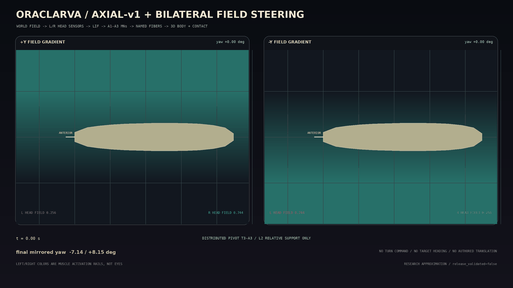

# Axial-v1 bilateral field steering

## Result

This stage adds world-field-driven left/right yaw to the frozen Python
`dmel_l1_axial_locomotion_v1` reference. It does not add a turn action, desired
heading, behavior state, policy output, or authored translation.



The causal path executed every 1 ms is:

```text
bounded world scalar field
  -> current left/right head-surface samples
  -> rectified lateral contrast
  -> side-resolved sensory LIF neurons
  -> side-resolved A1/A2 premotor LIF neurons
  -> existing side-resolved mapped motor identities
  -> existing named-fiber activation state
  -> left/right active-curvature constraint + frozen axial force
  -> frozen continuous ground contact
  -> new head positions sampled from the same field
```

The field never reads neural state, muscle state, requested movement, or the
measured yaw. Consequently, the sign and magnitude of yaw are outputs of the
closed loop rather than inputs to the body.

## Environment and sensory transform

The checked diagnostic field is deliberately generic:

```text
F(x,y) = clamp(b + gx*x + gy*y, 0, 1)
cL = clamp(k * max(0, F(left_head) - F(right_head) - threshold), 0, 1)
cR = clamp(k * max(0, F(right_head) - F(left_head) - threshold), 0, 1)
```

`F` is sampled at the moving bilateral head surface every time step. The
checked fixture uses `b=0.5` and `gy=+/-5000 m^-1`. These values, the contrast
gain, and the threshold are `MODEL_FITTED`. The field is not labeled light,
odor, temperature, reward, attraction, or avoidance; a modality-specific
receptor/connectome sign is outside this stage.

## Neural and muscle boundary

The added circuit contains only bilateral sensory and A1/A2 premotor sparse
LIF neurons with delayed synapses. A premotor spike supplies a delayed current
to a source ID already present as an actual motor-neuron node in axial v1. The
resulting spike is generated once by that shared node and enters the same
bounded named-fiber activation state used by axial locomotion. There is no
parallel steering-only motor-neuron copy.

Public A1 MN-to-muscle coverage is not bilaterally complete. Driving every
available A1 identity produced a large left/right mechanics bias. The steering
projection therefore uses only muscle numbers represented on both sides:

| Segment | paired muscle numbers | mapped MN sources per side | provenance |
| --- | --- | ---: | --- |
| A1 | 1, 10, 20 | 3 | original A1 edges remain `MEASURED_PUBLISHED`; pairing filter is `ANATOMY_DERIVED` |
| A2 | 1, 5, 8, 9, 10, 11, 18, 19, 20, 21, 22, 23, 24 | 13 | A2 targets remain `ANATOMY_DERIVED` homology |

No missing contralateral MN or muscle identity is invented. The 146-fiber
axial projection itself remains unchanged. A small residual axial-force
asymmetry is disclosed and bounded by the mirror gates rather than hidden with
side-specific gains.

Each steering-driven active fiber sample retains this ordered trace:

```text
body/field sample time <= sensory spike < premotor spike < MN spike < activation/force
```

The stored examples also include the two field intensities that caused the
sensory contrast.

## Mechanics

Axial force, local-tangent force projection, transverse contact activation,
and node-specific continuous contact retention use the same axial-v1
implementation. Under zero contrast, the complete 4 s steering trajectory
matches the frozen axial artifact with a maximum node error of
`4.64e-10 um`; activation and contact-retention errors are zero.

For nonzero contrast, the mean activation of bilaterally paired named fibers
sets the left and right rails of the existing active-curvature XPBD constraint.
The body receives neither a yaw angle nor a target curvature. Because measured
L1 3D moment arms are unavailable, the curvature gain is `MODEL_FITTED`; this
is not a claim that the reduced rail constraint is measured muscle mechanics.

## Checked results

The checked 4 s artifact reports:

| condition | x displacement (um) | y displacement (um) | yaw change | forward progress |
| --- | ---: | ---: | ---: | ---: |
| uniform field | -44.645 | 0.000 | 0.000 deg | 44.645 um |
| +Y gradient | -198.021 | +2.788 | -6.553 deg | 198.021 um |
| -Y gradient | -214.123 | -3.563 | +6.756 deg | 214.123 um |

Mirror residuals are `0.203 deg` heading, `16.102 um` world-x, and `0.776 um`
world-y. The engineering rejection limits are respectively `0.35 deg`,
`20 um`, and `20 um`. They are model gates, not measured L1 variability.

Both gradient cases also pass:

- maximum segment extension fraction below 0.05;
- minimum head-tail chord ratio above 0.75;
- maximum local inter-node bend below 55 degrees;
- integrated body-frame lateral slip below 80 um;
- every active body force traced to preceding sensory and neural events.

The observed bends are about 10.65 degrees per adjacent centerline pair, the
minimum chord ratio is about 0.983, and integrated lateral slip is about
35.5--36.0 um.

## Lesion checks

All lesions are applied to identified simulation nodes or named-fiber channels,
not to a behavior variable.

| +Y-gradient intervention | neural result | physical result |
| --- | --- | --- |
| right field sensory neuron | right steering path silent | yaw returns to 0; frozen axial displacement preserved |
| right A1+A2 shared MN sources | sensory/premotor spikes preserved; the actual axial MN spikes disappear | steering-force samples disappear; yaw magnitude falls from 6.553 to 2.070 degrees |
| right A1+A2 named fibers | sensory, premotor, and shared MN spikes preserved | steering-force samples disappear; yaw magnitude falls from 6.553 to 2.180 degrees |

MN and muscle lesions do not return to a perfectly symmetric body. The MN
lesion removes the actual shared axial MNs, while the muscle lesion removes the
same named fibers from both axial and steering force paths. Their expected
result is downstream attenuation with the appropriate upstream layers
preserved, not an artificial clamp to zero yaw or preservation of an unrelated
duplicate axial pathway.

## Reproduction

```bash
PYTHONPATH=src .venv/bin/python tools/export_axial_steering_trajectory.py
PYTHONPATH=src .venv/bin/python tools/evaluate_axial_steering.py
PYTHONPATH=src .venv/bin/python tools/render_axial_steering_gif.py

PYTHONPATH=src .venv/bin/python tools/export_axial_steering_trajectory.py --check
PYTHONPATH=src .venv/bin/python tools/evaluate_axial_steering.py --check
.venv/bin/pytest -q tests/test_axial_steering.py tests/test_axial_steering_artifact.py
```

Checked artifacts:

- `data/organism/l1_axial_steering_v1.json`: topology, provenance, parameters,
  limitations, and gates;
- `data/trajectories/l1_axial_steering_v1.json`: uniform/mirrored trajectories,
  neural and activation summaries, causal examples, and three lesions;
- `data/validation/axial_steering_v1.json`: fail-closed gate results and source
  hashes;
- `docs/assets/oraclarva_axial_steering_v1.gif`: 61 unique 1280x720 frames
  rendered only from the checked trajectory.

## Claim boundary

`release_validated` remains `false`. Passing these tests demonstrates that the
reduced model is causal, mirrored within declared engineering tolerances,
compatible with the frozen axial-v1 baseline, and lesionable. It does not
demonstrate an independently validated L1 steering connectome, a complete
brain, cognition, intent, natural taxis, or measured individual muscle moment
arms. Native/mobile integration remains deferred until this Python reference
stage is accepted.
