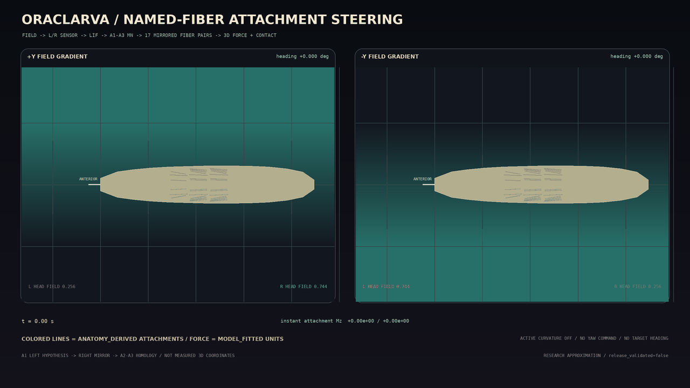

# Named-fiber attachment steering v1

## Result

This Python reference replaces the reduced active-curvature steering path with
forces from named A1-A3 muscle attachment lines. It preserves the accepted
axial-v1 and bilateral sensory/neural path. No turn action, requested yaw,
target heading, curvature input, behavior state, policy, or authored
translation is added.



The 1 ms causal path is:

```text
bounded world scalar field
  -> current left/right head-surface samples
  -> side-resolved sensory and premotor LIF dynamics
  -> existing A1-A3 motor-neuron identities
  -> shared named-fiber activation state
  -> paired left/right active-tension excess
  -> anatomy-derived attachment-line direction
  -> equal-and-opposite 3D shared-node force and resultant moment
  -> axial body constraints + continuous ground contact
  -> new head positions sampled from the same field
```

The body call executes with `active_curvature_gain=0.0`. Heading is measured
after the physics step; it is never an input.

## Attachment scope and provenance

Only muscle identities that have a left/right mapping and a non-transverse
attachment line in A1-A3 enter the new spatial force:

| segment | paired muscle numbers | pair count |
| --- | --- | ---: |
| A1 | 1, 10, 20 | 3 |
| A2 | 1, 5, 9, 10, 11, 19, 20 | 7 |
| A3 | 1, 5, 9, 10, 11, 19, 20 | 7 |

The 17 pairs are a subset of the existing 146 mapped fibers. Transverse fibers
remain part of contact-release control and do not receive a spatial steering
force.

The coordinate provenance is `ANATOMY_DERIVED`:

- A1-left uses the existing deterministic normalized attachment hypothesis,
  constrained by qualitative muscle-group topology from Zarin et al.
  ([doi:10.7554/eLife.51781](https://doi.org/10.7554/eLife.51781)) and attachment
  topology from Carayon et al.
  ([doi:10.7554/eLife.57547](https://doi.org/10.7554/eLife.57547)).
- A1-right is an exact theta mirror.
- A2 and A3 reuse the A1 normalized arrangement by segment homology.

These are not digitized or measured 3D L1 attachment coordinates. No
individual CSA, PCSA, Fmax, stress, or force in newtons is supplied. All force
parameters remain `MODEL_FITTED` model units.

## Force reduction

For each mirrored identity pair, the runtime compares active tension only:

```text
dT = T_active_left - T_active_right
T_excess = abs(dT)
u = normalize(insertion - origin) for the stronger side
F_origin = +scale * T_excess * u
F_insertion = -scale * T_excess * u
```

The origin and insertion forces are distributed to the two shared centerline
nodes with their normalized `s` coordinates. Their summed force is zero up to
floating-point error. The reduced node representation also records the
resultant moment about the current body center.

Axial-v1 already contains the active tension in its local-tangent projection.
To avoid double counting, the stronger-side excess contribution is subtracted
from that axial proxy before its full 3D attachment-line contribution is
added. Common left/right tension, passive tension, damping, all other mapped
fibers, and continuous contact keep the frozen axial path.

The one new numeric parameter is
`spatial_attachment_force_scale=0.3`. It was selected from the declared
`0.005--1.0` engineering sweep to satisfy uniform regression, mirror, force
balance, distributed-bend, distortion, and slip gates. It is not a measured
biological force gain.

## Causal trace

The exact activation state can outlive the latest field-driven motor spike and
can receive a later axial spike from the same shared MN. The runtime therefore
retains the latest ordered field-origin witness per fiber while a unilateral
activation excess remains. Every intact spatial force sample satisfies:

```text
body/field sample <= sensory spike < premotor spike < MN spike < force time
```

This is an audit trail for the causal field contribution to the pair
asymmetry. It is not a decomposition of the nonlinear activation state into
independent axial and steering forces.

## Checked 4 s results

| condition | x displacement | y displacement | heading change | forward progress |
| --- | ---: | ---: | ---: | ---: |
| uniform field | -44.645 um | 0.000 um | 0.000 deg | 44.645 um |
| +Y gradient | -76.751 um | +1.741 um | +0.724 deg | 76.751 um |
| -Y gradient | -76.733 um | -1.731 um | -0.726 deg | 76.733 um |

The field is a generic scalar, not an attraction or aversion label. Its sign
does not claim a biological preference. Reversing the gradient reverses the
complete force moment, planar deformation, lateral displacement, and heading.

Observed engineering checks include:

| check | observed |
| --- | ---: |
| uniform maximum node error vs frozen axial-v1 | 4.64e-10 um |
| mirror heading error | 0.00179 deg |
| maximum attachment net-force residual | 1.14e-13 model units |
| attachment moment impulse | +0.005880 / -0.005880 model-unit m s |
| traced attachment force samples | 67,236 / 67,236 per gradient |
| maximum local 3D bend | 7.326 deg |
| minimum head-tail chord ratio | 0.99379 |
| integrated body-frame lateral slip | 2.38 um |

The lateral-only planar-bend integral is nonzero at all four anterior joints:

| joint | mirrored mean (deg s) |
| --- | ---: |
| T3-A1 | 0.021693 |
| A1-A2 | 0.011636 |
| A2-A3 | 0.011033 |
| A3-A4 | 0.009786 |

T3-A1 is dominant and accounts for 40.06% of the four-joint total, below the
45% single-hinge rejection limit. Passive body constraints propagate some
deformation beyond the driven A1-A3 region; the outside-pivot share is 47.80%
and is explicitly bounded rather than described as measured localization.

## Lesion checks

Lesions operate on neural nodes, named fibers, or the attachment-force
coupling—not on a desired behavior.

| +Y intervention | upstream result | mechanics result |
| --- | --- | --- |
| right sensory node | right sensory path is silent | spatial force and heading change return to zero; frozen axial path is restored |
| right A1-A3 shared MNs | sensory and premotor spikes remain; those real MN spikes disappear | field-driven muscle-force samples disappear; loss of the shared axial side produces a predicted opposite residual response |
| right A1-A3 attachment lines | sensory, premotor, MN, and muscle-force samples are unchanged | spatial attachment force and heading change are zero |

The shared-MN lesion is not expected to preserve ordinary axial symmetry,
because there is deliberately no duplicate steering-only MN path.

## Reproduction

```bash
PYTHONPATH=src .venv/bin/python tools/export_named_fiber_steering_trajectory.py
PYTHONPATH=src .venv/bin/python tools/evaluate_named_fiber_steering.py
PYTHONPATH=src .venv/bin/python tools/render_named_fiber_steering_gif.py

PYTHONPATH=src .venv/bin/python tools/export_named_fiber_steering_trajectory.py --check
PYTHONPATH=src .venv/bin/python tools/evaluate_named_fiber_steering.py --check
.venv/bin/pytest -q tests/test_fiber_body.py tests/test_named_fiber_steering.py
```

Checked artifacts:

- `data/organism/l1_named_fiber_steering_v1.json`: causal topology, provenance,
  fitted scale, limitations, and gates;
- `data/trajectories/l1_named_fiber_steering_v1.json`: 401-frame uniform and
  mirrored trajectories, 17 pair identities, traces, forces, moments, and
  lesions;
- `data/validation/named_fiber_steering_v1.json`: source hashes and fail-closed
  engineering gates;
- `docs/assets/oraclarva_named_fiber_steering_v1.gif`: 61 frames rendered from
  checked physical nodes, activation, and attachment-moment telemetry.

## Claim boundary and next step

`release_validated` remains `false`. The result demonstrates a causal,
lesionable, numerically balanced attachment-force research approximation. It
does not demonstrate measured L1 muscle mechanics, a complete steering
connectome, natural taxis, intention, thought, consciousness, or independent
biological validation.

The next scientific step is body representation v2: add oriented/deformable
cross-sections or shell degrees of freedom so off-center attachment forces can
deform the cuticle and pressure field directly instead of being reduced to
centerline-node forces. Native/mobile integration remains deferred until that
reference mechanics boundary is accepted.
