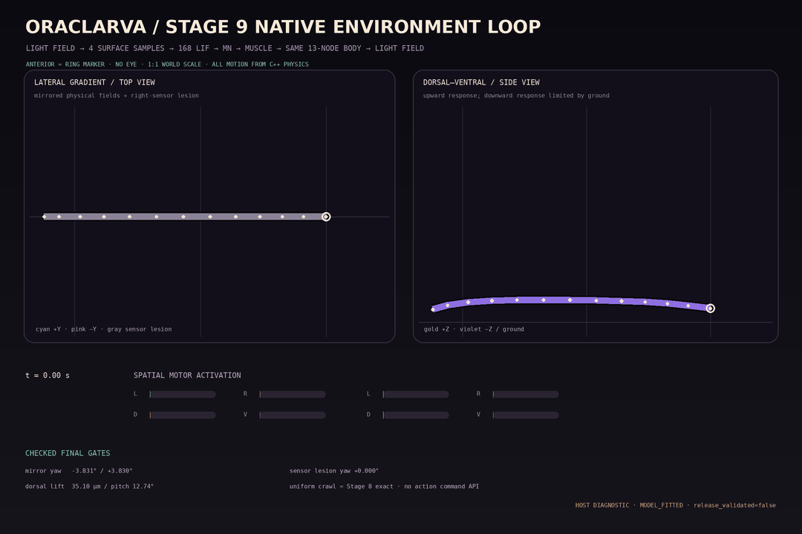

# Stage 9 native integrated environment closed loop

## Result

Stage 9 moves the light-driven spatial closed loop into the same dependency-free
C++17 state that already executes repeat crawl. A mobile host can now provide a
physical scalar light field, advance one fixed 1 ms step, and read the resulting
sensory, neural, muscle, and 3D body state through an additive C11 ABI. It cannot
provide a heading, turn, gait, target, animation, or other behavior command.



The checked host diagnostic follows this causal order on every step:

```text
physical light field
  → left/right/dorsal/ventral head-surface samples
  → adaptation and sensory transduction
  → 168-neuron sparse LIF dynamics
  → spatial motor neurons
  → segment muscle activation
  → yaw/pitch constraints in the same 13-node repeat body
  → updated surface locations in the physical light field
```

The axial Stage 8 controller and the new spatial controller both write forces or
constraints into one `RepeatBody`. There is no second kinematic body, authored
trajectory, FSM, behavior tree, or policy network.

## Native boundary

`native/mobile_environment.h` extends, rather than replaces,
`native/mobile_core.h`. The original eight Stage 8 functions and their layout
remain unchanged. Three new functions create a spatial core, advance the
integrated environment, and copy an environment snapshot:

```c
oraclarva_mobile_create_spatial(...);
oraclarva_mobile_advance_environment(...);
oraclarva_mobile_read_environment_snapshot(...);
```

The input contains light-field origin, value, spatial gradient, temporal rate,
and physical bounds plus the existing posterior-touch intensity. The snapshot
contains all 13 physics nodes, 12 bilateral yaw and pitch activations, four
raw/adapted samples, receptor currents, 168 spike counts, heading, pitch, and
3D displacement. Lesions are explicit interventions declared at creation.

`tools/export_native_spatial_fixture.py` deterministically compiles the existing
Python spatial model into
`data/parity/spatial_environment_native_v1.tsv`: 168 neurons, 188 sparse
synapses, four sensory channels, and ten spatial wave segments. The fixture is
checked against its generator before native tests run.

## Checked host results

All values below come from `data/trajectories/l1_native_environment_closed_loop_v1.json`.
The GIF renders its stored C++ physics nodes; it does not synthesize motion.
Both GIF panels use a 1:1 world-coordinate scale.

| Diagnostic | Checked result |
| --- | ---: |
| Uniform field, 14.6 s anatomical forward | 467.5393 µm |
| Uniform heading change | 0.0000° |
| Retained-frame maximum backward retrace | 14.4972 µm |
| Retained-frame progress efficiency | 0.8710 |
| +Y field heading change | -3.8310° |
| -Y field heading change | +3.8303° |
| Mirror heading residual | 0.0008° |
| +Z field vertical displacement | +35.0960 µm |
| +Z field head pitch | +12.7382° |
| -Z field vertical displacement | +0.1809 µm, ground-limited |
| +Y field with right sensory lesion | 0.0000° heading change |

The uniform field reproduces the Stage 8 corrected final displacement to
`1e-8 µm`; equal spatial drives therefore do not perturb axial crawl. Mirrored
lateral gradients produce opposite heading changes. A channel lesion abolishes
the corresponding differential turn, retaining a causal intervention boundary.
The +Z/-Z comparison is intentionally asymmetric because ground contact blocks
downward penetration.

An independent Python/C++ parity test drives identical transduced currents for
200 steps and compares all 168 per-neuron spike counts and last-step spikes. The
existing Stage 8 one-shot, stepped-mobile, lesion, and Python parity tests also
remain active locally.

## Scientific and product boundary

This remains a `research_approximation` with `release_validated=false`.

- Light is the only Stage 9 environment modality implemented in the native
  integrated ABI. Python temperature and odor diagnostics are not claimed as
  native yet.
- Light-field and transducer gains are `MODEL_FITTED`. The diagnostic gradients
  are synthetic fields, not measured L1 assay conditions.
- The four-channel spatial topology is `ANATOMY_DERIVED`; it is not a complete
  visual connectome and does not establish validated phototaxis.
- Body, muscle, bending, contact, and pressure proxies remain `MODEL_FITTED`.
- Spatial proprioceptive synapses are retained in the fixture, but their coupling
  into the axial repeat body is explicitly disabled. The former isolated spatial
  loop was not calibrated after cross-coupling and caused uniform-light drift.
  It must not be enabled until a separate calibration and regression gate exists.
- Results are Linux host diagnostics. Android/iOS builds, device performance,
  thermal behavior, battery use, and application lifecycle remain untested.
- GitHub Actions remains manual-only (`workflow_dispatch`); local acceptance is
  the default for this research phase.

## Reproduce

```bash
python tools/export_native_spatial_fixture.py --check
python tools/build_mobile_core.py --output /tmp/oraclarva-stage9-mobile
python tools/export_native_environment_trajectory.py --check
python tools/render_native_environment_gif.py
pytest -q tests/test_native_environment_closed_loop.py
```
